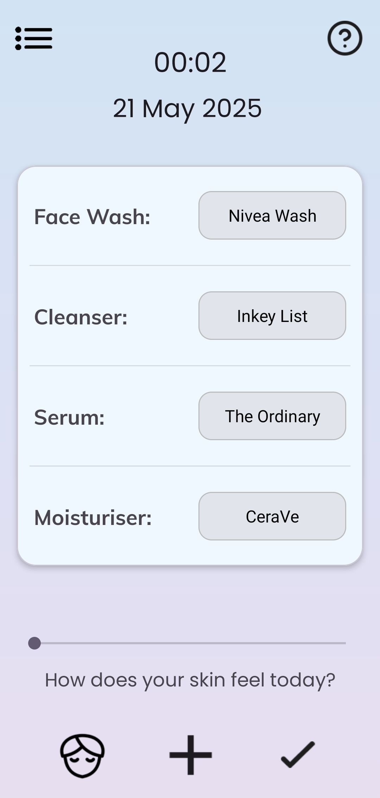
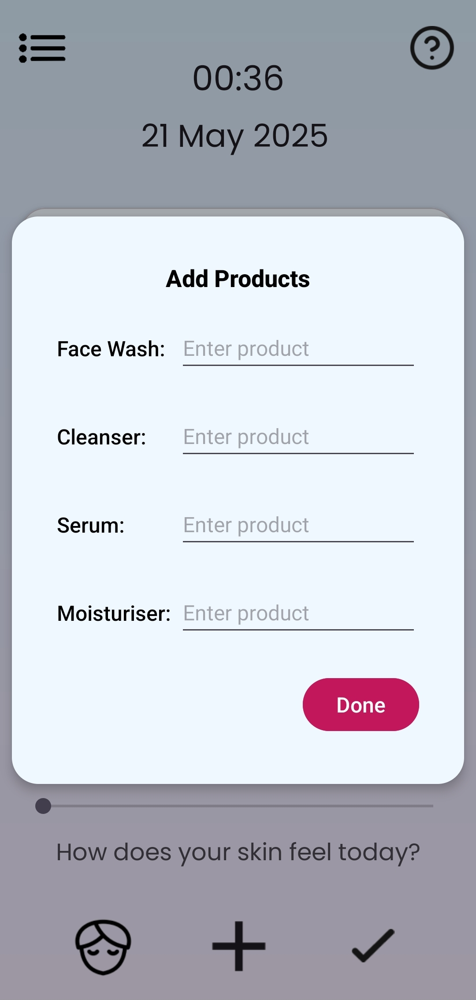
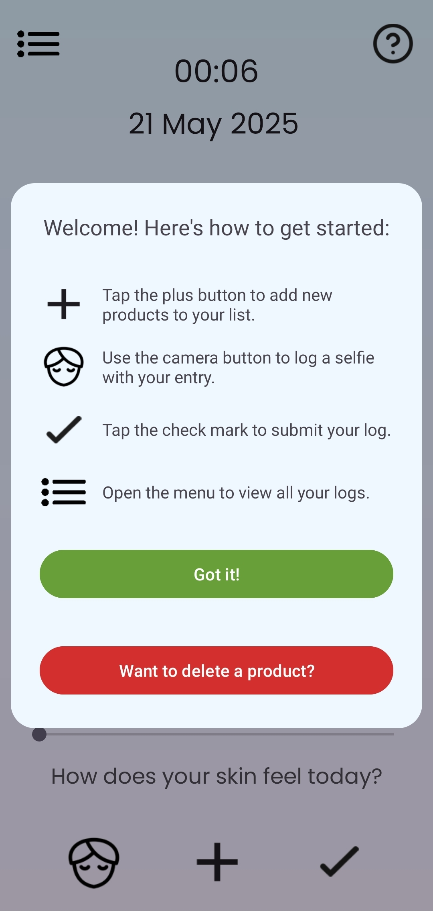
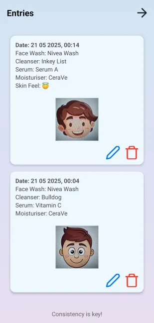
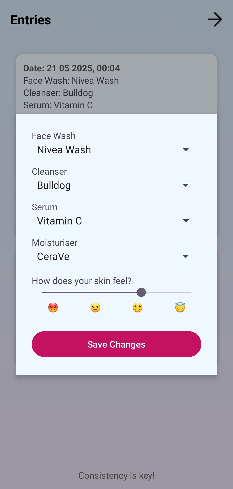
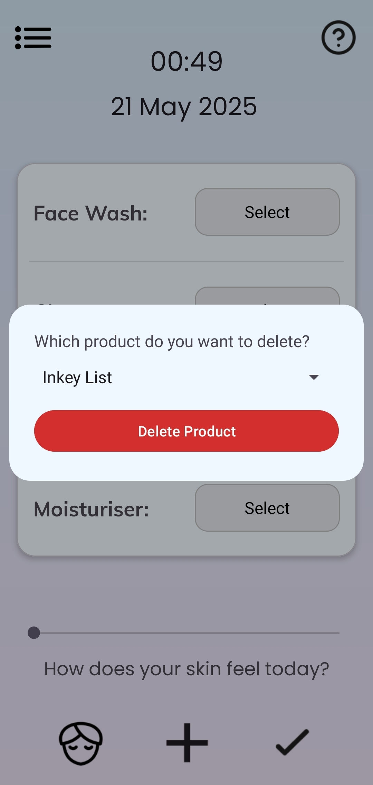

# 🧴 **SkinNote**

**SkinNote** is a minimalist Android app for tracking your skincare routine. Select your products, log your daily usage, and optionally upload selfies to monitor skin progress over time.

---

## 🚀 **Features**

-  Choose and save skincare products
-  Save your product choices using **Room database**
-  Upload selfies with each log entry
-  View and manage product logs in a **RecyclerView**
-  Logs include timestamps for each entry
-  Delete products directly via a custom dialog

---

## 🖼️ **Screenshots**

<table>
  <tr>
    <td align="center"><b>Home</b></td>
    <td align="center"><b>Add Product</b></td>
    <td align="center"><b>Help</b></td>
  </tr>
  <tr>
    <td></td>
    <td></td>
    <td></td>
  </tr>
  <tr>
    <td align="center"><b>Log</b></td>
    <td align="center"><b>Edit Product</b></td>
    <td align="center"><b>Delete Product</b></td>
  </tr>
  <tr>
    <td></td>
    <td></td>
    <td></td>
  </tr>
</table>

---

## 🛠️ **Tech Stack**

- **Kotlin** & Jetpack libraries
- **Room** for local database
- **Material3** UI components
- **Custom dialogs**
- **Splash screen API**

---

## 📦 **Installation**

1. Clone the repository:
```bash
git clone https://github.com/AntoOfo/SkinNote
cd SkinNote
```
2. Open the project in Android Studio.

3. Let Gradle sync and download all dependencies.

5. Run the app on an emulator or physical Android device.

---

## 📁 **License**

Licensed under the MIT License.
